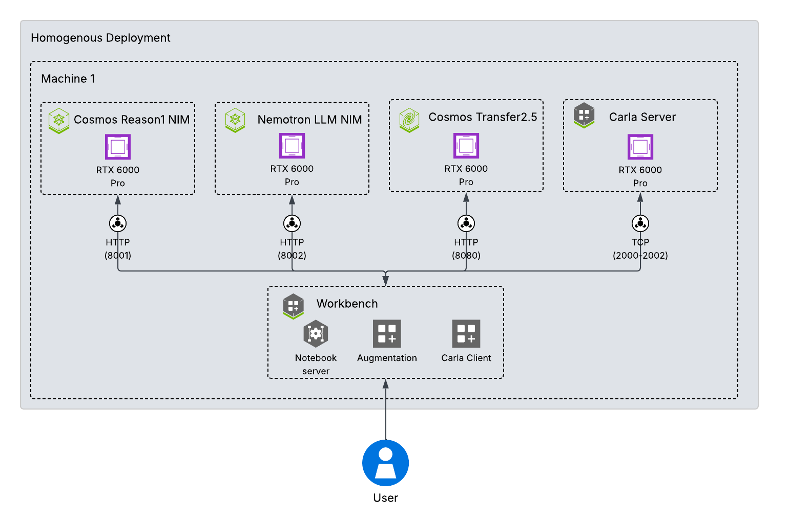
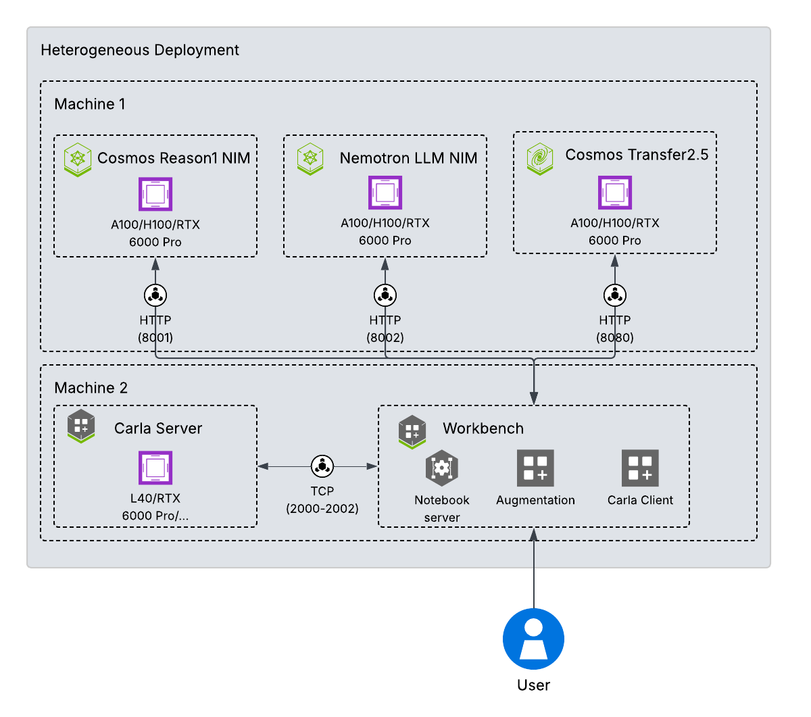

# Synthetic Data Generation for Smart City Applications

An end-to-end workflow for generating photo-realistic synthetic data for Vision-Language Models (VLMs) training on traffic scenarios. The pipeline simulates scenes in CARLA, extracts rich ground truth, applies COSMOS photo-realistic augmentation, and performs SoM-aligned post-processing.

- **What it does**: Turns CARLA simulation recordings into curated, photo-realistic videos and annotations for VLM training.
- **Who it’s for**: Machine Learning and Deep Learning engineers and researchers building perception and VLM systems for Smart City applications.
- **How it runs**: Docker Compose stack with a Workbench, CARLA server, NVIDIA VLM/LLM models, and NVIDIA Cosmos-Transfer.


---

## Contents
- [Synthetic Data Generation for Smart City Applications](#synthetic-data-generation-for-smart-city-applications)
  - [Contents](#contents)
  - [Overview](#overview)
  - [Architecture](#architecture)
  - [Prerequisites](#prerequisites)
    - [Obtain API keys](#obtain-api-keys)
    - [Workflow Inputs](#workflow-inputs)
      - [Maps](#maps)
      - [Scenario Logs](#scenario-logs)
      - [Recorder Config](#recorder-config)
  - [System Requirements](#system-requirements)
  - [Quickstart (Docker Compose)](#quickstart-docker-compose)
  - [Configuration](#configuration)
  - [Advanced Configuration](#advanced-configuration)
  - [Workflow Usage (Stage-by-Stage)](#workflow-usage-stage-by-stage)
  - [Data Layout and Examples](#data-layout-and-examples)
  - [Troubleshooting / FAQ](#troubleshooting--faq)
  - [Security and Compliance](#security-and-compliance)
  - [Contributing and Support](#contributing-and-support)
  - [License and Citation](#license-and-citation)


---

## Overview
This workflow provides a Synthetic Data Generation (SDG) recipe to produce VLM-ready datasets for smart city applications:
- CARLA-based scenario simulation and recording
- Ground-truth extraction (RGB, Depth, Segmentation, Normals, 2D/3D bounding boxes, events)
- COSMOS-Transfer photo-realistic augmentation guided by multi-modal inputs and prompts
- SoM-aware post-processing to preserve object correspondence across modalities

Primary components:
- `modules/carla-ground-truth-generation`: CARLA ground-truth extraction and dataset tooling
- `modules/augmentation`: Prompting, template/prompt generation, and COSMOS execution utilities
- `modules/postprocess/postprocess_for_vlm.py`: SoM-aligned overlays/validations
- `deploy/compose`: Docker Compose assets (`deploy.sh`, `*.yml`, `.env`)
- `docker/Dockerfile.workbench`: Notebook-centric workbench image
- `notebooks/carla_synthetic_data_generation.ipynb`: End-to-end notebook walkthrough

---

## Architecture
- **Workbench**: Jupyter Lab environment with Python tooling, CARLA client, augmentation runners, and notebooks
- **CARLA Server (0.9.16)**: Simulator for generating diverse traffic scenarios (GPU-accelerated)
- **NVIDIA NIM services (optional)**:
  - Cosmos-Reason1 for captioning and scene description
  - Cosmos-Transfer2.5 for photo-realistic video augmentation
  - Nemotron for template/prompt generation

Key ports:
- Workbench: `8888`
- Cosmos-Reason1 NIM: `8001`
- Nemotron LLM NIM: `8002`
- Cosmos-Transfer Gradio: `8080` (host networking; `8003` if using bridge mapping)
- CARLA: `2000` RPC, `2001` UDP, `2002` TCP

---

## Prerequisites
### Obtain API keys
* [NGC API key](https://org.ngc.nvidia.com/setup/api-keys)
  * Steps to setup [HERE](https://docs.nvidia.com/ngc/latest/ngc-user-guide.html#generating-api-key)
* [Hugging Face Token](https://huggingface.co/settings/tokens):
  * Ensure your hugging face token has access to Cosmos-Transfer2.5 checkpoints 
    * Get a [Hugging Face Access Token](https://huggingface.co/settings/tokens) with Read permission
    * Install [Hugging Face CLI](https://huggingface.co/docs/huggingface_hub/en/guides/cli)
    * Login with `hf auth login`.
    * Read and accept the [NVIDIA Open Model License Agreement](https://huggingface.co/nvidia/Cosmos-Predict2.5-2B)
    * Read and accept the [terms for Cosmos-Guardrail1](https://huggingface.co/nvidia/Cosmos-Guardrail1)
    * Read and accept the [terms for Cosmos-Transfer2.5](https://huggingface.co/nvidia/Cosmos-Transfer2.5-2B)

### Workflow Inputs
The SDG workflow requires 3 unique inputs: maps, scenario logs, and sensor config. This [repository](https://github.com/inverted-ai/metropolis/) provides a small number of examples for each, from Inverted AI (see step 2 of quickstart). Please see the following sections for descriptions and ways to generate your own.

#### Maps
A map includes both the 3D model of a location and its road definition. A map's road definition is based on an OpenDRIVE file. CARLA provides a set of [pre-built maps](https://carla.readthedocs.io/en/latest/catalogue/#maps) that can be used for building and testing this SDG workflow. Further details about maps and their elements can be found [here](https://carla.readthedocs.io/en/latest/core_map/). To create a digital twin of a real-world location, a browser plugin with a CARLA bridge from [AVES Reality](https://avesreality.com/) can be used.

#### Scenario Logs
Along with the map, the workflow requires a scenario log. This file defines the list of actors (vehicles and pedestrians) and exactly how they move during playback, e.g. collision, wrong way driving. CARLA provides a set of vehicle [assets](https://carla.readthedocs.io/en/latest/catalogue_vehicles/) to use in the simulation.

* To generate scenarios with simple, randomized traffic, please refer to the [CARLA quick start guide](https://carla.readthedocs.io/en/latest/start_quickstart/#run-a-python-client-example-script)
* Complex scenarios can be created using third-party tools. One such tool is [RoadRunner](https://www.mathworks.com/help/roadrunner/) from Mathworks. There are also providers like [InvertedAI](https://www.inverted.ai/home) who can generate scenarios based on your requirements.

Scenario simulation can be recorded and saved as a CARLA log file (in custom binary file format). The log file can then be played back, queried, and used to generate ground truths. See the [Recorder Config](#recorder-config) section for recorder details and helpful Python [scripts](https://carla.readthedocs.io/en/latest/adv_recorder/#sample-python-scripts) for this purpose.

The scenario logs used in this repo can be found [HERE](https://github.com/inverted-ai/metropolis/tree/master/examples)

#### Recorder Config
To generate the ground truths, the SDG workflow needs to know the location of the various CARLA sensors, and their attributes. Please refer to the provided [samples](https://github.com/inverted-ai/metropolis/tree/master/examples) for details.

## System Requirements
- Linux with NVIDIA GPU and drivers
- Docker Engine 28.0+ and Docker Compose v2
- NVIDIA Container Toolkit (GPU access)
- Git LFS (Large File Storage)
- Internet access for pulling images and model weights
- 250 GB Storage

Optional:
- X11 if you need on-screen rendering for CARLA; the stack defaults to offscreen rendering but mounts X11 by default for flexibility

| Component                 | GPU (recommended)  |VRAM (recommended)| Notes |
|---------------------------|--------------------|------------------|-------|
| VLM NIM (Cosmos-Reason1)  | 1 H100 / 1 RTX PRO 6000 |80GB| Refer to [model card](https://build.nvidia.com/nvidia/cosmos-reason1-7b/modelcard) for more details |
| LLM NIM (Nemotron Nano v2)| 1 H100 / 1 RTX PRO 6000 |80GB| Refer to [model card](https://build.nvidia.com/nvidia/nvidia-nemotron-nano-9b-v2/modelcard) for more details |
| Cosmos-Transfer2.5        | 1 H100 / 1 RTX PRO 6000 |80GB| Refer to [Github](https://github.com/nvidia-cosmos/cosmos-transfer2.5) for more details|
| CARLA Server              | 1 RTX PRO 6000 |12GB| Requires RTX compatible GPU. Refer to the [CARLA Docs](https://carla.readthedocs.io/en/latest/) for more details|


Recommended GPU configuration. Stage definitions are provided in the [Workflow Usage (Stage-by-Stage)](#workflow-usage-stage-by-stage) section.

| GPU Configuration | Stage 1 | Stage 2 | Stage 3 | End-to-end | 
|-------------------|---------|---------|---------|------------|
| 4x RTX PRO 6000   | ~9m     | ~20m    | ~1m     | ~30m       |

Times are measured for 1 augmentation with a 5s scenario on a homogeneous deployment with 4xRTX PRO 6000.

Notes:
- The provided compose defaults map in `deploy/compose/env.example` separates GPUs for each NIM service and CARLA (via GPU IDs in the env/compose files).
- Actual requirements depend on resolution, batch sizes, and concurrent workload. For lighter usage, fewer or smaller GPUs may work; for heavy concurrent augmentation or larger models, prefer A100/H100.
- On a system with good network speed (approximately 150 Mbps), the setup time takes roughly 30-45 minutes.

---

## Quickstart (Docker Compose)

1) Clone the repository 

```bash 
git clone <repository.git>
cd its-github 
```

2) Download sample CARLA logs

> **Note:** Sample logs are provided by Inverted AI. Please review the data [terms of use](https://github.com/inverted-ai/metropolis/blob/master/LICENSE.md) to determine whether they are appropriate for your purposes. If you have your own data, you may skip this step.
```bash
git clone https://github.com/inverted-ai/metropolis.git
mv ./metropolis/examples ./data/examples
```

3) Set up the deployment configuration. You need to provide your NGC_API_KEY [with access to pull images from build.nvidia](https://build.nvidia.com/settings/api-keys) and Hugging Face Token with access to the checkpoints mentioned under [Prerequisites](#prerequisites). The other parameters are optional to configure GPU IDs that each NIM/service should run on, and ports to launch the NIMs on. By default, they assume a homogeneous deployment to a system with at least 4x RTX 6000 Pro or equivalent. 

```bash
cd deploy/compose 
cp env.example env
# Edit values for NGC_API_KEY, HF_TOKEN, GPU IDs, ports, etc.
```


4) Deploy the stack. There are two main deployment options available:

- **Homogeneous Deployment:** This mode launches all NIM services (VLM, LLM, Cosmos-Transfer) and the Workbench on a single machine (default, no extra arguments). It is recommended for systems with at least 4 suitable GPUs (RTX support and 80+ GB VRAM). Simply run `./deploy.sh` to start the entire stack locally.

```bash
# On the target machine 
./deploy.sh 

# This spins up the Cosmos-Reason1, Nemotron NIMs, Cosmos-Transfer2.5 Gradio Server, CARLA Server, and the Jupyter notebook, which users can follow to generate photo-realistic synthetic data for VLMs.
# By default these are the ports where all of the services get deployed to.
# Workbench → http://<host>:8888
# NIMs: VLM http://<host>:8001, LLM http://<host>:8002, Cosmos-Transfer http://<host>:8080
```

> **Note:** On the first run, you may see warnings such as "pull access denied for `smartcity-sdg-workbench`" or for the Transfer Gradio container. This is expected and harmless—the required images are built locally by `deploy.sh` during initial setup.


- **Heterogeneous Deployment:** This mode allows you to run the NIM stack (VLM, LLM, Cosmos-Transfer) on one machine and the Workbench (with CARLA) on another, using the `nim` and `workbench` arguments respectively. This is useful if you wish to distribute resource usage across multiple hosts. You'll need to set the `NIM_HOST` environment variable on the Workbench node to point to the NIM node.


The NIM stack requires a machine with 3 GPUs with 80+ GB VRAM (Ampere or later) to launch the 3 inference endpoints using the command below:
```bash
./deploy.sh nim
# Note the printed NIM_HOST and use it on the workbench node.
```

Once the NIM stack is up, launch the CARLA server and notebook/workbench stack, which requires at least 1 RTX-compatible GPU (L40/RTX 6000 Pro or equivalent) using the following command:

```bash
# On the second machine, ensure steps 1-3 are complete to have the repository and configuration ready before this step.
export NIM_HOST=<ip_of_nim_node> # Set NIM host to IP of machine 1 printed in the previous step.
cd deploy/compose
./deploy.sh workbench
```

Choose the option that best fits your available hardware and workflow needs. 

5) Verify deployment and start using the system

- Check NIM health:
```bash
# If using heterogeneous deployment, set NIM_HOST to the NIM node IP first:
# export NIM_HOST=<ip_of_nim_node>
HOST=${NIM_HOST:-localhost}
curl http://$HOST:8001/v1/health/ready  # VLM should return "Service is live."
curl http://$HOST:8002/v1/health/ready  # LLM should return "Service is live."
```

- Cosmos-Transfer2.5 Gradio service:
  - The notebook communicates with the Gradio server via the Gradio client. Opening `http://localhost:8080` (or `http://$NIM_HOST:8080` in heterogeneous deployments) in a browser is optional and mainly useful to verify the service is up.

- Open the Workbench (Jupyter):
  - Visit `http://localhost:8888` (or `http://<WORKBENCH_HOST>:8888` if using heterogeneous deployment).
  - Open the notebook `notebooks/carla_synthetic_data_generation.ipynb`. It is a self-guided walkthrough covering all three stages using the deployed services:
    - Stage 1: CARLA ground truth generation
    - Stage 2: COSMOS photo-realistic augmentation
    - Stage 3: SoM-aligned post-processing for VLM training
---

## Configuration

Environment file (`deploy/compose/env.example`)
- Set credentials: `NGC_API_KEY`, `HF_TOKEN`
- Select GPUs per service: `*_GPU_ID`, `*_GPU_COUNT`
- Ports: `NOTEBOOK_PORT`, `VLM_PORT`, `LLM_PORT`, `TRANSFER_GRADIO_PORT`, `CARLA_PORT`
- Endpoints auto-derived from host and ports

CARLA ground-truth generation:
- JSON workflow/config and per-camera YAMLs (see `modules/carla-ground-truth-generation/config/`)
- Typical invocation from the repository root directory:
```bash
cd modules/carla-ground-truth-generation
python main.py --config config/wrong_way.json
# Or with workflow config overrides
python main.py --wf-config wf-config.json --config config/wrong_way.json
```

COSMOS augmentation (Cosmos-Transfer2.5):
- YAML config drives cameras, template/prompt generation, and COSMOS execution (see `modules/augmentation/configs/`)
- Typical invocation from workbench shell:
```bash
uv run modules/augmentation/modules/cli.py --config modules/augmentation/configs/config_carla.yaml
```

Notebook workflow:
- `notebooks/carla_synthetic_data_generation.ipynb`

## Advanced Configuration
- For a complete list of configuration options, field definitions, and recommendations, see `data/docs/advanced_configuration.md`.

---

## Workflow Usage (Stage-by-Stage)

Stage 1 — CARLA Ground Truth
- Inputs: CARLA logs (`.log`), camera spec (`.yaml`), scenario configs (`.json`)
- Execution: CARLA Server log playback
- Outputs (per scenario): `rgb/`, `depth/`, `semantic_segmentation/`, `instance_segmentation/`, `normals/`, `edges/`, masks, and ODVG JSONs; optional videos

Stage 2 — COSMOS Augmentation
- Inputs: videos and annotations from Stage 1; positive/negative prompts
- Execution: Cosmos-Transfer2.5 via Gradio or API; prompt/template generation via VLM/LLM
- Outputs: Augmented videos

Stage 3 — Post-processing for VLM
- Inputs: Augmented videos, Ground Truth metadata
- Outputs: SoM-aligned overlays, Q&A pairs

---

## Data Layout and Examples
Sample outputs are included under `data/outputs/`:
- `CARLA/default_run/scenario_1/` → simulator GT outputs and videos
- `Cosmos/default_run/scenario_1/` → stylized videos (augmentation variants)
- `postprocess/` → SoM overlays and annotations

Example configs and logs can be found [here](https://github.com/inverted-ai/metropolis).

---

## Troubleshooting / FAQ

### Setup related issues

**Docker/NVIDIA runtime issues:**
- Ensure Docker Engine 28.0+, Compose v2, NVIDIA Container Toolkit installed
- Validate GPU visibility:
```bash
docker run --rm --gpus all nvidia/cuda:12.2-runtime-ubuntu22.04 nvidia-smi
```

**NGC login required:**
- `docker login nvcr.io` with `$oauthtoken` and your `NGC_API_KEY`

**Docker permissions issues:**
- If you see the error `Got permission denied while trying to connect to the Docker daemon socket`, your user likely does not have permission to access Docker. Common solutions:
  - **Add your user to the `docker` group** (recommended):
    ```bash
    sudo usermod -aG docker $USER
    # Log out and back in again (or run `newgrp docker`), then try again
    ```
  - Alternatively, you may run commands with `sudo` (e.g., `sudo docker ...`) but editing group membership is preferred.
  - On some systems, check that the Docker service is running: `sudo systemctl status docker`
  - Ensure `/var/run/docker.sock` exists and is owned by `root:docker`
  - See [Docker post-installation steps](https://docs.docker.com/engine/install/linux-postinstall/) for more details


**Docker daemon not running / not accessible:**
- Symptoms include errors like "Docker daemon does not appear to be running or is not accessible for this user" or "Cannot connect to the Docker daemon at unix:///var/run/docker.sock".
- Check service status and start it:
```bash
sudo systemctl status docker
sudo systemctl start docker   # start now
sudo systemctl enable docker  # start on boot
```
- Verify connectivity:
```bash
docker info
docker ps
```
- If running without sudo, ensure your user is in the `docker` group (see "Docker permissions issues" above) and log out/in.


**File permissions on volumes:**
- Align host UID/GID with container (`LOCAL_UID`, `LOCAL_GID`) and ensure mounted dirs are readable/writable

**CARLA display:**
- Stack uses offscreen flags; if you need on-screen rendering, ensure X11 is available and `$DISPLAY` is set

**NIM host discovery:**
- In homogeneous mode `deploy.sh` sets and prints `NIM_HOST` automatically; in heterogeneous, set `NIM_HOST` on the workbench node

**Network issues:**
- Since the Docker Compose example pulls several NIM images, Cosmos-Transfer2.5 repository, and model checkpoints, ensure you have network connectivity with adequate speed to expedite the one-time build and setup phase, after which the models and images are typically cached to the system.

**Endpoint access issues:**
- In some systems, if the healthchecks at the beginning of the notebook keep failing after the NIMs are in a ready state, it is typically due to firewall issues. Ensure the ports in the range of 8001-8002, 8080, 8888, and 2000-2002 are accessible by the node running the workbench, referencing the host IP externally.

**Port availability issues**
- If you receive errors such as `address already in use` or `failed to bind port`, it typically means one of the required ports (8001, 8002, 8080, 8888, or 2000-2002) is already occupied by another process. 
  - Identify which process is using the port:
    ```bash
    sudo lsof -i :<PORT>
    # Example: sudo lsof -i :8001
    ```
  - If possible, stop the conflicting process or choose an alternate port.

**If you need to update ports in the environment file:**
- Open `deploy/compose/env` or `deploy/compose/env.example` and edit the relevant port variables (e.g., `VLM_PORT`, `LLM_PORT`, `TRANSFER_GRADIO_PORT`, `NOTEBOOK_PORT`, `CARLA_PORT`, etc.).
- Save the changes and re-run `deploy.sh`.
- Make sure to use the updated ports when accessing services (e.g., Jupyter notebook, CARLA client, or NIM endpoints).


### Notebook issues 

**Unhealthy endpoints:**
- In systems with low network speed, the NIMs take some time to start up since it pulls checkpoints and initializes the inference engines. Ensure to check the logs of the containers to see if the endpoints are healthy.
```bash
docker logs reason1-nim
# Should have the following line 
# ...
# INFO 2025-11-10 19:28:46.972 server.py:214] Uvicorn running on http://0.0.0.0:8001 (Press CTRL+C to quit)

docker logs llm-nim
# Should have the following line 
# ...
# INFO 2025-11-10 19:27:42.916 server.py:214] Uvicorn running on http://0.0.0.0:8002 (Press CTRL+C to quit)

docker logs transfer2_5-gradio
# Should have the following line 
# ...
# [11-10 19:25:53|INFO|cosmos_transfer2/inference.py:108:__init__] Saved config to outputs/config.yaml
```


---

## Security and Compliance
- Never commit secrets. Use `deploy/compose/env.example` as a template and keep your real `env` out of version control
- Review third-party licenses used by COSMOS, NIM images, and CARLA
- Production deployments should add logging/monitoring, authN/authZ, and secret rotation

---

## Contributing and Support
- See `CONTRIBUTING.md` and `CODE_OF_CONDUCT.md`
- Open issues for bugs and questions; include logs, compose files, and environment details

---

## License and Citation
- License: see `LICENSE` (and module-level licenses where applicable)
- If your work uses this pipeline or its components, please cite relevant NVIDIA works and CARLA.

